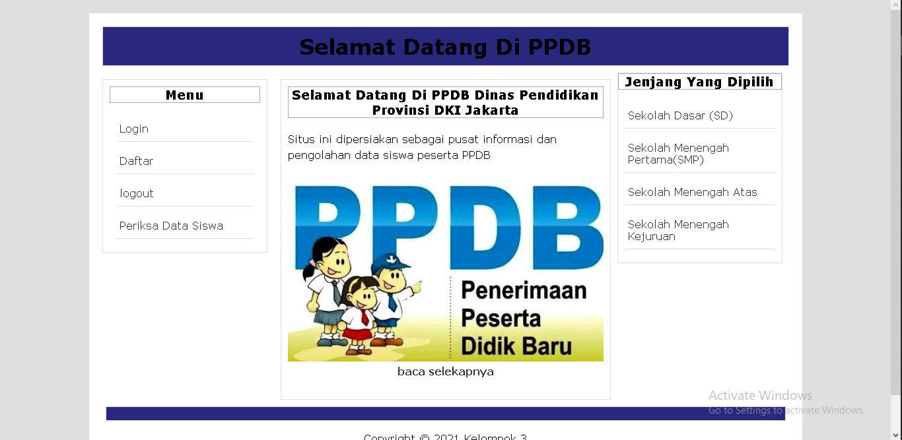

# Project PPDB
tema : pengolahan data peserta PPDB
keunggulan : sebagai pusat informasi dan pengolahan data siswa peserta PPDB
Penjelasan : Website PPDB ini memudahkan pengguna untuk memeriksa dan pengolahan data-data siswa, selanjutnya pengguna bisa daftar atau menggajukan akun dan masuk ke website untuk melakukan pemilihan jenjang yang diinginkan seperti SD, SMP, SMA, dan SMK, berikutnya setelah melakukan pemilihan jenjang sekolah, pengguna dapat melakukan pencarian kembali data siswa yang ingin diperiksa.
Kelompok3 :

- Muhammad Reza (19200915)

- Muammar Fuad Siregar (19200924)

- Said Imam Puro(19201080)

- Mohammad Salman Ramadhan(19201058) 

